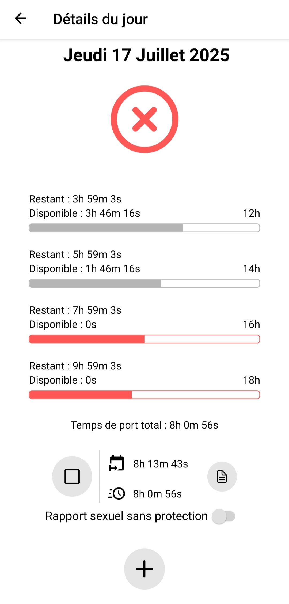
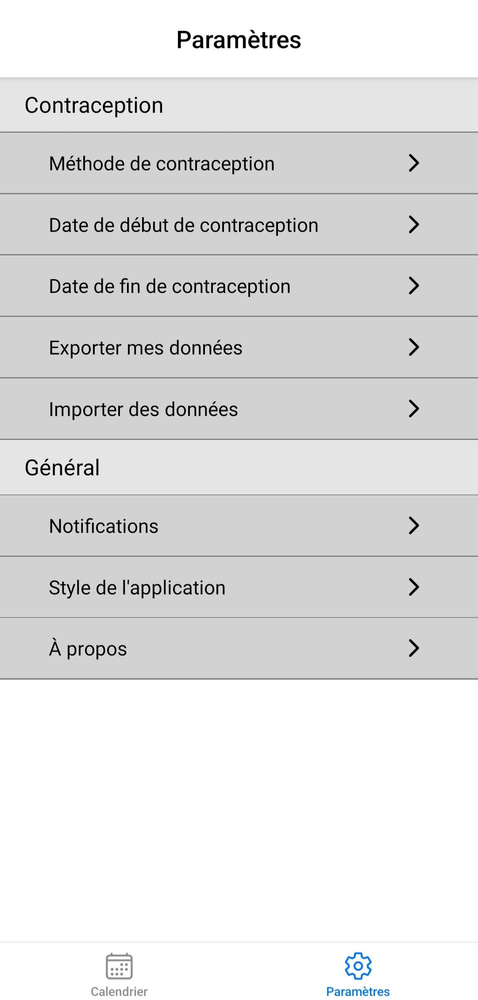
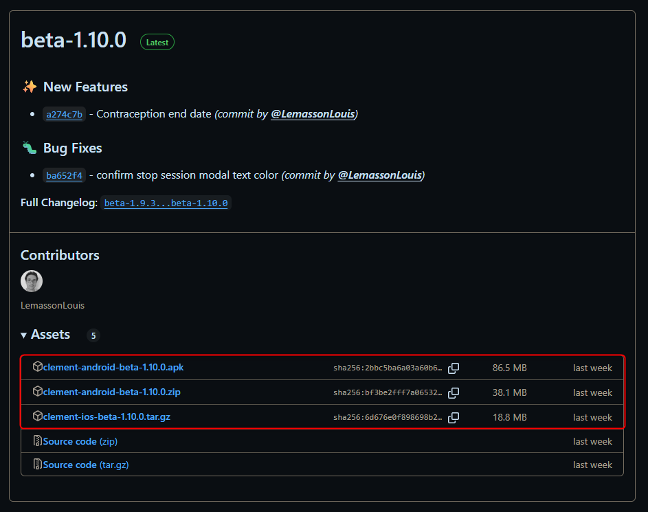

# L'application Clément

Clément est l'application open source visant à aider au suivis de la contraception masculine thermique.

&nbsp;&nbsp;&nbsp;&nbsp;&nbsp;&nbsp;

Fonctionnalités :
* Supporte différentes méthodes de contraception thermique
* Gestion de sessions de port par jour
* Calendrier récapitulatif
* Détail de chaque jour
* Système de notification
* Annotation des session de port
* Gestion des dates de début et fin de contraception
* Import et export de données
* Mode clair/sombre


## Télécharger l'application

Rendez-vous dans les [releases de l'application](https://github.com/LemassonLouis/Clement/releases) et sélectionner le lien correspondant à votre appareil :
* `.apk` pour Android (existe aussi en .zip)
* `tar.gz` pour iOS
<details>

</details>


## Installer l'application

### Pour Android

Une fois l'apk téléchargé (ou le zip téléchargé et dézippé), il suffit de cliquer sur l'apk pour lancer l'installation.

### Pour iOS

(prochainement)


## Pour les développeurs

This is an [Expo](https://expo.dev) project created with [`create-expo-app`](https://www.npmjs.com/package/create-expo-app).

## Get started

1. Install dependencies

   ```bash
   npm install
   ```

2. Start the app

   ```bash
   npm run start
   ```

In the output, you'll find options to open the app in a

- [development build](https://docs.expo.dev/develop/development-builds/introduction/)
- [Android emulator](https://docs.expo.dev/workflow/android-studio-emulator/)
- [iOS simulator](https://docs.expo.dev/workflow/ios-simulator/)
- [Expo Go](https://expo.dev/go), a limited sandbox for trying out app development with Expo

You can start developing by editing the files inside the **app** directory. This project uses [file-based routing](https://docs.expo.dev/router/introduction).
